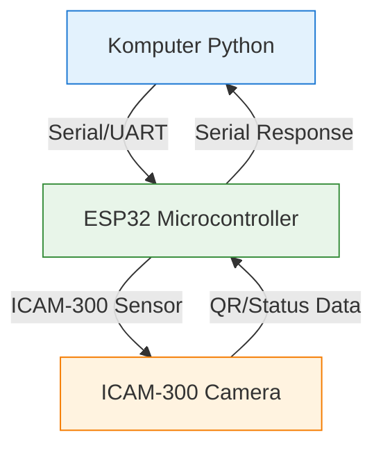

# SortVision - Serial Communication ICAM

> Dokumentasi komunikasi serial antara Python dan mikrocontroller (ESP32) untuk sistem ICAM (Industrial Camera) pada lini konveyor.

## Overview

Alur data:
1. **Python → Microcontroller (Serial/UART)**: Perintah/konfigurasi QC
2. **Microcontroller → Python**: Hasil bacaan sensor/QR dari ICAM-300
3. **Python ↔ Microcontroller**: Tukar data real-time untuk kontrol conveyor

## Prasyarat

- Python 3.9+
- ESP32 atau mikrocontroller seri lainnya
- Library: `pyserial`
- ICAM-300 (Advantech smart camera) atau simulator

## Konfigurasi Port Serial

### Python (kirim dan terima)

```python
import serial
import time

# Konfigurasi port
SERIAL_PORT = 'COM3'  # atau '/dev/ttyUSB0' di Linux/Mac
BAUD_RATE = 115200

def kirim_ke_mikrocontroller(data: str):
    """Kirim data ke mikrocontroller"""
    with serial.Serial(SERIAL_PORT, BAUD_RATE, timeout=1) as ser:
        ser.write((data + '\n').encode('utf-8'))
        time.sleep(0.1)
        # Baca balasan dari mikrocontroller
        if ser.in_waiting:
            balasan = ser.read(ser.in_waiting).decode('utf-8').strip()
            return balasan
    return None

def baca_dari_mikrocontroller():
    """Terus-baca data dari mikrocontroller"""
    with serial.Serial(SERIAL_PORT, BAUD_RATE, timeout=1) as ser:
        while True:
            if ser.in_waiting:
                data = ser.readline().decode('utf-8').strip()
                print(f"[ICAM] {data}")
            time.sleep(0.01)

if __name__ == '__main__':
    # Contoh: Kirim perintah baca QR
    hasil = kirim_ke_mikrocontroller('READ_QR')
    print(f"Balasan: {hasil}")
```

### Mikrocontroller (Arduino/ESP32 Code)

```cpp
#include <HardwareSerial.h>

// Definisi pin serial
HardwareSerial SerialPort(2); // UART2 di ESP32

void setup() {
  // Serial untuk komputer
  Serial.begin(115200);
  // Serial untuk ICAM-300 atau perangkat lain
  SerialPort.begin(9600, SERIAL_8N, 16, 17); // RX=16, TX=17
  
  Serial.println("System Ready");
}

void loop() {
  // Baca dari ICAM-300 atau sensor
  if (SerialPort.available() > 0) {
    char c = SerialPort.read();
    
    // Jika menerima perintah "READ_QR" dari Python
    if (String(c) == 'R') {
      // Baca seluruh pesan
      String cmd = Serial.readStringUntil('\n');
      if (cmd == "READ_QR") {
        // Simulasi bacaan QR dari ICAM-300
        String qr_data = "SORTVISION|PROD001|ULTRA-MILK-001";
        SerialPort.println(qr_data);
      }
    }
  }
  
  // Bisa juga terus-kirim status ke Python
  Serial.println("STATUS:OK");
  delay(100);
}
```

## Alur Komunikasi



## Endpoint Pesan

| Pesan | Deskripsi | Format Balasan |
|-------|-----------|----------------|
| `READ_QR` | Minta bacaan QR terkini | `SORTVISION\|code\|sku` |
| `GET_STATUS` | Cek status sistem | `STATUS:OK\|v1.0.0` |
| `SET_CONVEYOR` | Set kecepatan conveyor | `CONVEYOR:SPEED:<value>` |
| `RESET` | Reset sistem | `RESET:DONE` |

## Integrasi dengan ML Service

Python bisa kirim data serial ke micros, lalu data tersebut dikirim ke ml-service via HTTP:

```python
import requests

# Baca dari serial first
serial_data = kirim_ke_mikrocontroller('READ_QR')

# Kirim ke ml-service API
response = requests.post(
    'http://127.0.0.1:8000/api/detection',
    json={'qr_code': serial_data, 'camera': 'ICAM-300'}
)

if response.status_code == 200:
    result = response.json()
    print(f"QC Verdict: {result['verdict']}")
```

## Setup Development

1. **Install library Python**:
   ```bash
   pip install pyserial requests
   ```

2. **Flash mikrocontroller**:
   - Gunakan Arduino IDE atau PlatformIO
   - Sesuaikan baud rate dan pin serial

3. **Test koneksi**:
   ```bash
   python tools/serial_test.py --port COM3 --baud 115200
   ```

4. **Jalankan bersama Laravel**:
   - Laravel mengelola database deteksi
   - ML service menginfer gambar dari ICAM-300
   - Serial komunikasi untuk kontrol real-time conveyor

## Troubleshooting

| Masalah | Solusi |
|---------|--------|
| `PermissionError: [Errno 13]` | Jalankan dengan hak admin/root, atau ubah izin port |
| `Read timeout expired` | Cek baud rate cocok di keduanya, cek kabel serial |
| Data berantakan | Tambahkan `ser.flush()` di awal, cek baud rate dan bit setting |
| Tidak ada respons dari ICAM | Cek koneksi ICAM-300 ke micros, power cycle |

## Referensi

- [PySerial Documentation](https://pypi.org/project/pyserial/)
- [ICAM-300 Advantech SDK](https://www.advantech.com/)
- [ESP32 Arduino Serial](https://docs.espressif.com/projects/esp-idf/en/latest/api/peripherals/uart.html)